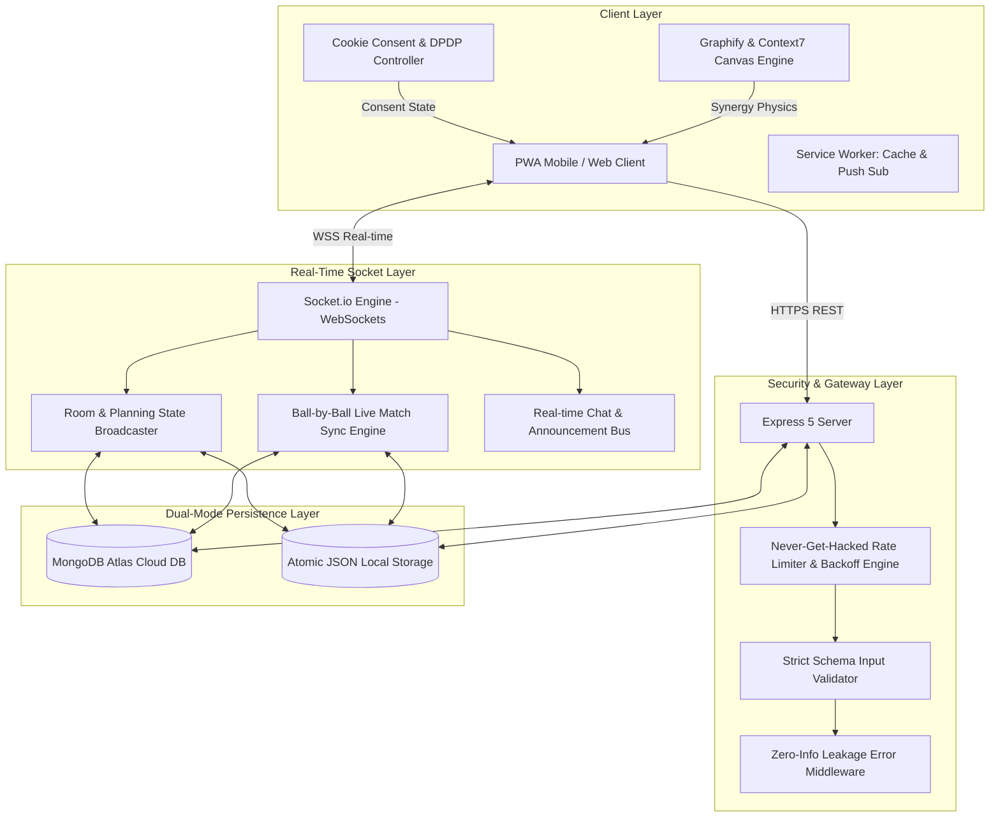

# 🏗️ CricketHub — Technical Architecture Document

**Architecture Version:** 3.0.0  
**Stack:** Node.js (v20+), Express 5, Socket.io, Vanilla JS, CSS3 Design Tokens, MongoDB Atlas (Dual-Mode)  

---

## 1. System Overview & Architecture Diagram

---

## 2. Layer Specifications

### 2.1. Client-Side Architecture (Vanilla Modular JS)
- **Zero Framework Bloat**: Pure native DOM manipulation for sub-millisecond interaction latency and 60fps animations.
- **State Management**: Reactive global `state` object (`state.session`, `state.room`, `state.myGroups`, `state.activeTab`).
- **Graphify Engine ([public/graphify.js](file:///Users/saurabkumar/cricket/public/graphify.js))**: HTML5 Canvas with force-directed Verlet physics calculation, link spring forces, and repulsion fields.
- **Privacy & Cookie Consent ([public/cookie-consent.js](file:///Users/saurabkumar/cricket/public/cookie-consent.js))**: Opt-in category management with `localStorage` persistence and dynamic script execution hooks.

### 2.2. Real-Time Socket.io Subsystem
- **Room Partitions**: Each active match room is isolated in an internal socket room `CRK-XXXX`.
- **User Direct Addressing**: Direct push pings target specific users via private rooms `user:<phone>`.
- **Deduplication & Throttling**: Message ID hashing and rate limiting on socket level (6 chat messages per 5 seconds).

### 2.3. Dual-Mode Storage Engine
- **Cloud Mode**: Connects to MongoDB Atlas via native `mongodb` driver (`users`, `rooms`, `groups`, `matches`, `push_subscriptions` collections).
- **Atomic Local Mode**: Fallback to local JSON files (`data/*.json`) using atomic temp-file write & rename semantics to prevent data corruption during unexpected restarts.

### 2.4. Security Architecture (Never-Get-Hacked)
1. **Tiered Rate Limiter**:
   - Auth Routes: $10\text{ req/min}$ (prod) / $40\text{ req/min}$ (dev) with exponential backoff on invalid OTP attempts.
   - Public Routes: $120\text{ req/min}$.
   - Authed User Routes: $500\text{ req/min}$.
2. **Strict Schema Input Validation**:
   - Type, length, regex, and integer boundary checks on all REST endpoints and Socket payloads.
3. **Information Leakage Suppression**:
   - Internal stack traces, raw database errors, and system file paths stripped from client responses.
