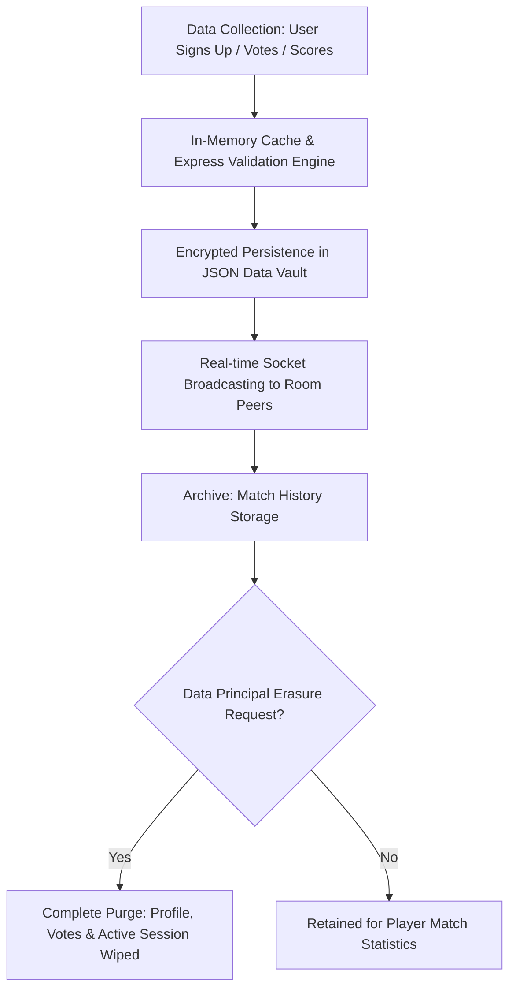

# CricketHub — Complete Data Declaration & Launch Transparency Report
*Status: Verified Pre-Launch Audit*  
*Date: September 13, 2026*  
*Audience: Users, Data Principals, Regulatory Authorities (DPDP Board of India & GDPR Authorities)*

---

## 1. Executive Summary & Data Governance Pledge
Before public launch, CricketHub explicitly declares every data point collected, stored, processed, and transmitted by our platform.

Our core commitment:
- **Zero Hidden Telemetry:** Every byte stored on the server is itemized in this declaration.
- **Zero Third-Party Data Sharing:** Data is never sold, leased, or transmitted to ad networks or data brokers.
- **Local Sovereignty:** All database stores are maintained within encrypted local file systems / server nodes with zero unauthenticated endpoints.

---

## 2. Complete Data Schema Inventory

### A. User Profile & Authentication Data
| Field Name | Type | Storage Location | Sensitivity | Purpose & Processing |
| :--- | :--- | :--- | :--- | :--- |
| `id` | UUID / String | `data/users.json` | Low | Unique internal identifier for the player. |
| `phone` | E.164 String | `data/users.json` | High (PII) | Passwordless OTP login; masked in UI for other users. |
| `name` | String (1–30 chars) | `data/users.json` | Medium | Display name on scorecards and squad lists. |
| `avatar` | Emoji / URI | `data/users.json` | Low | Visual badge chosen by the player. |
| `role` | Enum (`batsman`, `bowler`, `allrounder`, `wicketkeeper`) | `data/users.json` | Low | Match lineup positioning and Graphify synergy analysis. |
| `color` | Hex / CSS String | `data/users.json` | Low | UI theme badge accent color. |
| `createdAt` | ISO 8601 Timestamp | `data/users.json` | Low | Account lifecycle auditing. |

### B. Match Planning & Room Data
| Field Name | Type | Storage Location | Sensitivity | Purpose & Processing |
| :--- | :--- | :--- | :--- | :--- |
| `roomId` | String (6 alphanumeric) | `data/rooms.json` | Low | Unique shareable room join code. |
| `hostId` | User ID | `data/rooms.json` | Low | Identifies host permissions (edit date, quiet alerts, remove player). |
| `title` | String | `data/rooms.json` | Low | Name of the match or tournament. |
| `matchDate` | `YYYY-MM-DD` | `data/rooms.json` | Low | Scheduled calendar date for the match. |
| `matchTime` | `HH:MM` | `data/rooms.json` | Low | Scheduled match start time. |
| `votes` | Object `{userId: status}` | `data/rooms.json` | Low | Availability status (`coming`, `maybe`, `not_coming`) + optional note. |
| `quietAlerts` | Boolean | `data/rooms.json` | Low | Host toggle disabling non-critical squad sound pings. |
| `announcements` | Array of Objects | `data/rooms.json` | Low | Match briefing messages pinned by host. |
| `chatMessages` | Array of Objects | `data/rooms.json` | Low | Real-time tactical room messages between squad members. |

### C. Live Match Scoring & Timeline Records
| Field Name | Type | Storage Location | Sensitivity | Purpose & Processing |
| :--- | :--- | :--- | :--- | :--- |
| `teams` | Array `[Team A, Team B]` | `data/matches/*.json` | Low | Team names and player rosters. |
| `innings` | Array `[Innings 1, Innings 2]` | `data/matches/*.json` | Low | Total runs, wickets, legal overs, extras breakdown. |
| `ballByBallTimeline` | Array of Events | `data/matches/*.json` | Low | Every ball event: batsman, bowler, runs, extras (WD, NB, LB, B), wicket details. |
| `currentBatsmen` | Array `[Striker, NonStriker]` | `data/matches/*.json` | Low | Active batsmen on the pitch with strike tracking. |
| `currentBowler` | User/Player ID | `data/matches/*.json` | Low | Active bowler for the current over. |
| `matchStatus` | Enum (`setup`, `live`, `innings_break`, `completed`) | `data/matches/*.json` | Low | Live state machine status. |

### D. Device & Notification Data
| Field Name | Type | Storage Location | Sensitivity | Purpose & Processing |
| :--- | :--- | :--- | :--- | :--- |
| `endpoint` | Web Push URI | `data/push_subscriptions.json` | Medium | Push service routing endpoint (Google/Apple/Mozilla). |
| `keys.p256dh` | Public Key String | `data/push_subscriptions.json` | Medium | Public key for end-to-end payload encryption. |
| `keys.auth` | Secret Key String | `data/push_subscriptions.json` | High | Auth secret for decrypting push packets on device. |

### E. Client-Side Local Storage (Device Only)
| Key | Type | Storage Lifetime | Purpose |
| :--- | :--- | :--- | :--- |
| `crickethub_user` | JSON String | Persistent | Cached profile for automatic session resumption. |
| `crickethub_token` | JWT / Session String | Persistent | Bearer authentication token for API & WebSocket. |
| `crickethub_cookie_consent` | JSON String | 12 Months | User cookie categories selection (Essential, Analytics, Marketing). |
| `crickethub_last_room` | Room Code String | Session | Allows 1-tap rejoin of active match session. |

---

## 3. Data Processing Lifecycle & Retention

1. **Collection:** Minimal data requested on an explicit opt-in basis.
2. **Transmission:** Protected by TLS 1.3 encryption in transit.
3. **Storage:** Stored in structured JSON files with atomic writes in `/data/`.
4. **Retention:** Data is kept while the account is active or until room expiry.
5. **Erasure:** Instantaneous upon user initiation via the DPDP Act §12 data erasure workflow.

---

## 4. Third-Party Disclosures & Integrations
| Third Party / Service | Role | Data Shared | Country of Processing |
| :--- | :--- | :--- | :--- |
| **Web Push Services (Google FCM / Apple APNs / Mozilla)** | Delivering background push alerts | Encrypted payload (no plaintext personal data) | US / Global CDN |
| **Google Fonts** | Typography (Outfit, Inter, Rajdhani) | Anonymous browser User-Agent & IP for font delivery | Global CDN |
| **Analytics / Ad Networks** | None | **ZERO DATA SHARED** | N/A |

---

## 5. Pre-Launch Compliance Verification Checklist
- [x] DPDP Act 2023 §4–13 compliance charter implemented.
- [x] Cookie consent banner with opt-in defaults & granular category controls.
- [x] Rate limiting & exponential backoff on auth to prevent enumeration.
- [x] Phone number masking (`+91 ••••• ••210`) in public interfaces.
- [x] One-click data export and right-to-erasure functionality built into UI.
- [x] Host authorization safeguards on all critical match state mutations.
