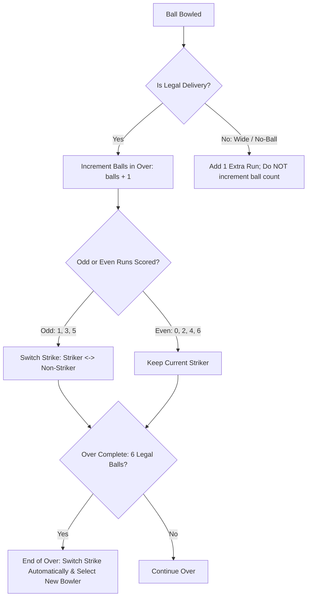

# 📜 CricketHub — Cricket Rules & Business Logic Engine

This document defines the mathematical and rule-based logic governing match scoring, strike rotation, bowler limits, and game states in CricketHub.

---

## 1. Strike Rotation & Ball Counting Rules

---

## 2. Specific Dismissal Rules & Attribution

| Dismissal Type | Bowler Wicket Credit? | Striker / Non-Striker Status | Runs Counted? |
| :--- | :---: | :--- | :---: |
| **Bowled** | ✅ Yes | Striker Out | No |
| **Caught** | ✅ Yes | Striker Out | No |
| **LBW** | ✅ Yes | Striker Out | No |
| **Stumped** | ✅ Yes | Striker Out | No (Wide extra if off wide) |
| **Hit Wicket** | ✅ Yes | Striker Out | No |
| **Run Out** | ❌ No | User selects Out Batsman (Striker or Non-Striker) | Completed runs credited |
| **Retired Hurt** | ❌ No | Batsman retires; replacement takes crease | Completed runs credited |

---

## 3. Extras & Penalty Calculations

- **Wide Delivery**: $+1$ run to batting team, $+1$ extra to team extras (`extras.wides`), 0 legal balls bowled. Batsmen may run additional bye runs off wides.
- **No-Ball**: $+1$ run to batting team, $+1$ extra (`extras.noBalls`), 0 legal balls bowled.
  - **Free Hit Rule**: The next legal delivery is marked as a Free Hit delivery. Batsman cannot be dismissed Caught, Bowled, LBW, or Stumped (only Run Out).
- **Byes & Leg Byes**: Runs credited to team total and extras, not batsman's personal score. Legal ball counts towards over.

---

## 4. Innings Completion & Match Result Calculations

1. **Innings 1 Complete Condition**:
   - Overs bowled == Match Total Overs (e.g. 20.0 overs) **OR**
   - Wickets fallen == Total Team Players $- 1$ (All Out) **OR**
   - Host / Captain declares innings complete.
2. **Innings 2 Target & Win Calculation**:
   - $\text{Target} = \text{Innings 1 Runs} + 1$.
   - Batting Team Wins if $\text{Innings 2 Runs} \ge \text{Target}$.
   - Bowling Team Wins if $\text{Innings 2 Wickets} == \text{All Out}$ OR $\text{Overs} == \text{Max Overs}$ and $\text{Innings 2 Runs} < \text{Target} - 1$.
   - **Tie / Super Over**: If runs are exactly equal at innings end, match enters `super_over_1` state.

---

## 5. Host & Participant Permissions Matrix

| Capability | Host / Captain | Room Participant | Logged Out Viewer |
| :--- | :---: | :---: | :---: |
| **Toggle Quiet Alerts** | ✅ Yes | ❌ No | ❌ No |
| **Remove Player from Room** | ✅ Yes | ❌ No | ❌ No |
| **Edit / Reschedule Date & Time** | ✅ Yes | ❌ No | ❌ No |
| **Delete Announcements & Chats** | ✅ Yes | ❌ No | ❌ No |
| **Score Match Ball-by-Ball** | ✅ Yes | ✅ If Assigned Scorer | ❌ Read Only |
| **Ping Individual Teammate** | ✅ Yes (when Quiet OFF) | ✅ Yes (when Quiet OFF) | ❌ No |
| **Vote Availability (RSVP)** | ✅ Yes | ✅ Yes | ❌ Must Login |
