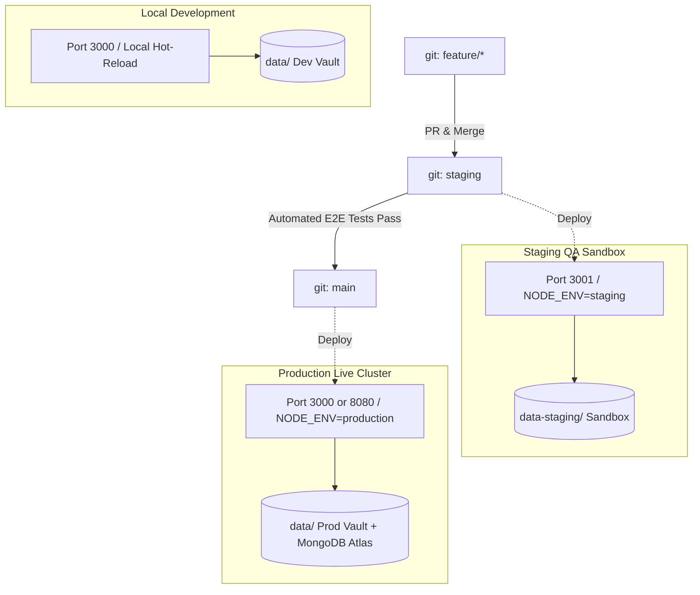

# CricketHub — Staging & Production Multi-Environment Guide

*Document Version: 3.0.0*  
*Architecture: Dual-Sandbox Cloud & Local Container Ready*

---

## 1. Environment Topology Overview

CricketHub provides complete physical and logical isolation between **Development**, **Staging (QA Sandbox)**, and **Production**.



---

## 2. Environment Comparison Matrix

| Configuration / Feature | Development (`development`) | Staging (`staging`) | Production (`production`) |
| :--- | :--- | :--- | :--- |
| **Port** | `3000` | `3001` | `3000` (or `8080` / `$PORT`) |
| **Data Directory** | `data/` | `data-staging/` (Isolated) | `data/` |
| **Dev OTP in API Response** | ✅ Enabled (`devOtp` in payload) | ✅ Enabled for Automated QA Suites | 🔒 **Disabled** (Plain SMS only) |
| **Rate Limiter Thresholds** | Relaxed for rapid dev testing | Moderately relaxed for test bots | 🛡️ **Hardened** (6 auth attempts / min) |
| **Exponential Backoff** | Active (Fast recovery) | Active | 🛡️ **Strict Active** |
| **Error Handling** | Detailed logs & traces | Detailed logs & traces | Zero Information Leakage |
| **Database Sandbox** | Local JSON / `crickethub_dev` | `data-staging/` / `crickethub_staging` | `data/` / `crickethub_production` |
| **Health Check Endpoint** | `/api/health` | `/api/health` & `/api/environment` | `/api/health` & `/api/environment` |

---

## 3. Dedicated NPM Lifecycle Commands

```bash
# ── STAGING COMMANDS ──────────────────────────────────
# 1. Start Staging Server on Port 3001 with data-staging sandbox
npm run start:staging

# 2. Run automated E2E tests against Staging instance
npm run test:staging

# 3. Clean Staging Sandbox data
npm run staging:clean

# ── PRODUCTION COMMANDS ───────────────────────────────
# 1. Start Production Server on Port 3000 with hardened security
npm run start:prod

# 2. Run master E2E test verification
npm run test:e2e

# 3. Run Never-Get-Hacked Enterprise Security Audit
npm run security:audit
```

---

## 4. Git Branching & Promotion Strategy

1. **`main` Branch (Production):**
   - Represents live production code.
   - Protected: Direct pushes prohibited; requires pull request from `staging`.
   - Continuous Deployment pushes automatically to production host.
2. **`staging` Branch (Staging / Pre-Release):**
   - Represents release candidates.
   - Automatically deployed to staging server (`http://staging.crickethub.app` or `:3001`).
   - Automated E2E verification suites (`npm run test:e2e`) run against the staging sandbox.
3. **`feature/*` Branches (Development):**
   - Active development branches branched off `staging`.

---

## 5. Docker Multi-Environment Deployment

### A. Run Staging via Docker Compose
```bash
docker compose -f docker-compose.staging.yml up -d --build
# Staging health check: http://localhost:3001/api/health
```

### B. Run Production via Docker Compose
```bash
docker compose -f docker-compose.prod.yml up -d --build
# Production health check: http://localhost:3000/api/health
```

---

## 6. GitHub Actions CI/CD Pipeline Configuration

```yaml
# .github/workflows/deploy.yml
name: CricketHub Staging & Production CI/CD

on:
  push:
    branches: [ staging, main ]
  pull_request:
    branches: [ staging, main ]

jobs:
  test_and_audit:
    runs-on: ubuntu-latest
    steps:
      - uses: actions/checkout@v4
      - uses: actions/setup-node@v4
        with:
          node-version: 20
      - run: npm ci
      - run: npm run security:audit
      - run: npm test

  deploy_staging:
    needs: test_and_audit
    if: github.ref == 'refs/heads/staging'
    runs-on: ubuntu-latest
    steps:
      - name: Deploy to Staging Cluster
        run: echo "Deploying release candidate to Staging Environment (Port 3001)..."

  deploy_production:
    needs: test_and_audit
    if: github.ref == 'refs/heads/main'
    runs-on: ubuntu-latest
    steps:
      - name: Deploy to Production Cluster
        run: echo "Deploying verified build to Production Environment..."
```
